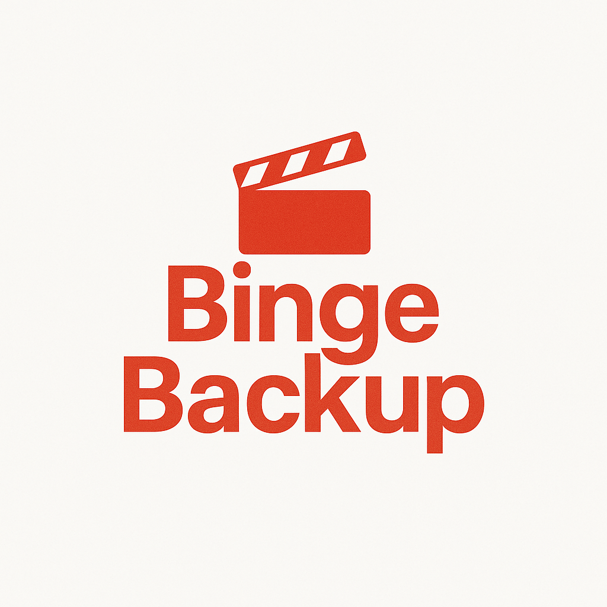
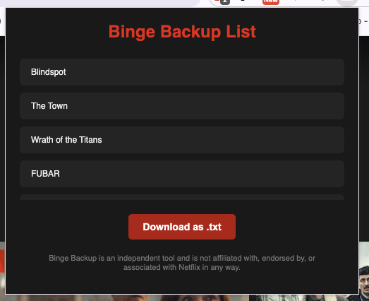

# Binge Backup 🎬

**Binge Backup** is a lightweight Chrome Extension that lets you export your *My List* movies and shows from Netflix (or similar layouts) into a downloadable `.txt` file — one title per line.

No fluff, no tracking, no frills. Just your list, backed up.

---

## ✨ Features

- 📄 View all titles in your Netflix **My List** page
- 📥 Export the list as a `.txt` file — one item per line
- 🖥️ Clean, modern popup UI
- 🚫 Not affiliated with Netflix in any way

---

## 📸 Screenshot

---

## 🧩 Installation (Unpacked)

To install this extension manually in Chrome:

1. Download or clone this repo
2. Open Chrome and go to `chrome://extensions/`
3. Enable **Developer mode** (top-right toggle)
4. Click **"Load unpacked"**
5. Select the folder where this repo was extracted

Done! Now visit your Netflix **My List** page and click the extension icon to use it.

---

## ⚠️ Disclaimer

> **Binge Backup** is an independent tool and is not affiliated with, endorsed by, or associated with Netflix in any way.

---

## 🛠️ Built With

- Plain JavaScript
- HTML5/CSS3
- Chrome Extensions API (Manifest V3)

---

## 📄 License

MIT — feel free to fork and enhance. Pull requests welcome.

---

Made with ❤️ by Chris
https://chrishacia.com
